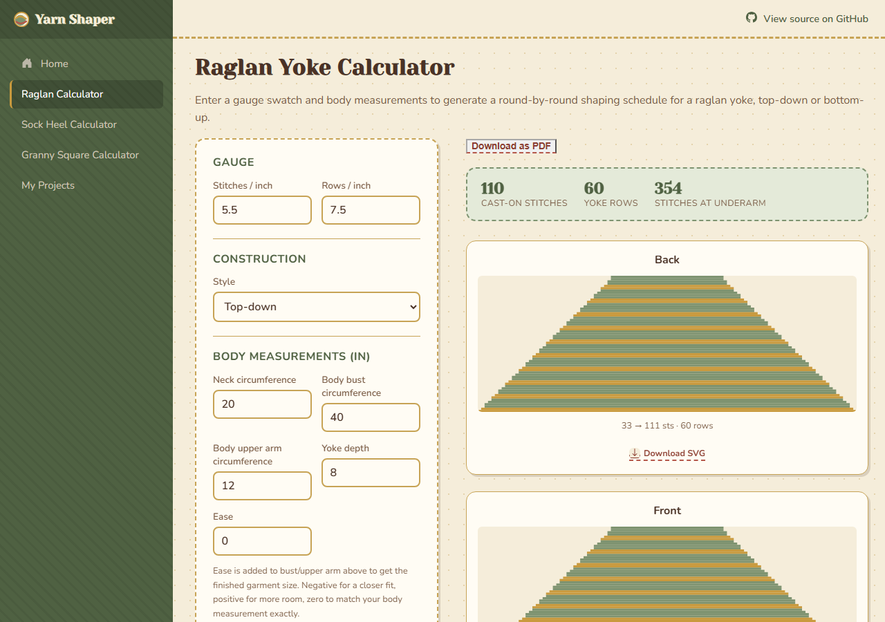
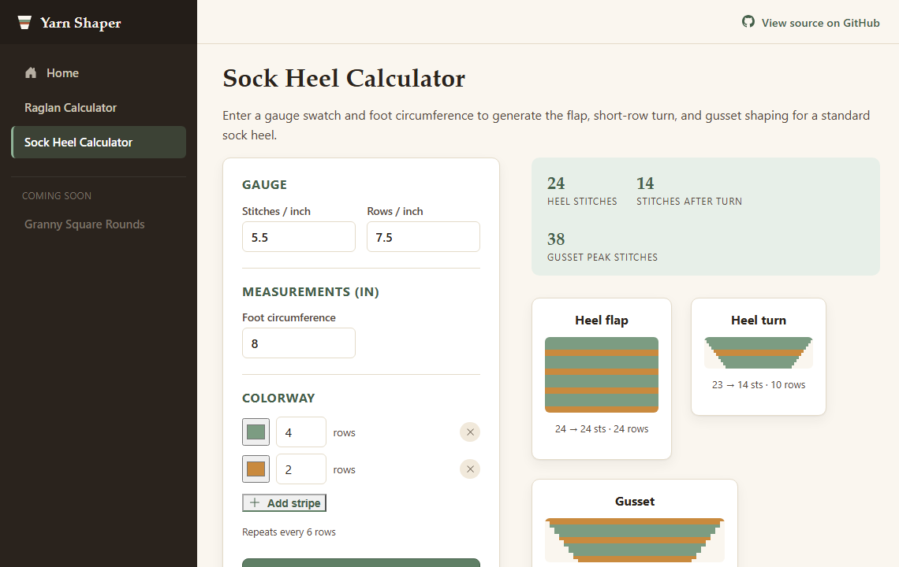
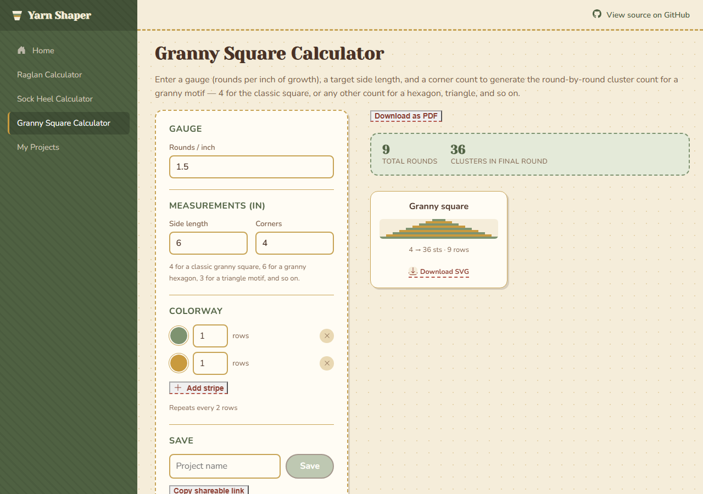

# Yarn Shaper

A garment-shaping calculator, not a form-and-database CRUD app: it turns
gauge and body measurements into the actual round-by-round stitch math a
hand-knit sweater is built from, then renders that math live as an SVG
schematic — no static mockup, no JS charting library, no backend. Everything,
including the shaping algorithms, is C# compiled to WebAssembly and run
entirely in the browser.

**Live demo:** [mollygilchrist03.github.io/YarnShaper](https://mollygilchrist03.github.io/YarnShaper/)







## What it does

Enter a gauge (stitches/rows per inch) and a set of finished measurements,
and the raglan calculator produces a full round-by-round shaping schedule
for a top-down raglan yoke — back, front, and both sleeves — then draws
each section as a schematic: cast-on at the neck, widening step by step
toward the underarm, exactly matching the computed stitch counts.

A colorway picker sits alongside it: build a stripe sequence (color + row
count per stripe), and it's mapped onto the real row data — all four
sections recolor in sync, since a raglan yoke is worked in the round and
row N is the same physical round in every section.

The sock heel calculator is a second, mechanically different
construction: a square heel flap, a short-row heel turn that narrows to a
point, and a gusset that picks up stitches along the flap and decreases
them back out — reusing the same schematic renderer and colorway picker,
proving the pipeline isn't raglan-specific.

The granny square calculator is the simplest of the three: one round-based
section that grows by a constant 4 clusters every round. Its default
colorway alternates every single round rather than every few rows — the
classic "different color each round" granny square look — which the same
`ColorwayMapper` handles without any changes.

The raglan and sock heel pages also estimate yardage per color from the
active colorway — how many yards of each stripe color the piece actually
uses, not just how many rows it spans. Every schematic can be downloaded
as a standalone SVG file straight from the card it's rendered on.

## Notable engineering decisions

- **The shaping math is the actual point, so it's isolated and tested on
  its own.** `YarnShaper.Core` has zero UI dependencies — the raglan
  calculator ([`RaglanShapingCalculator.cs`](src/YarnShaper.Core/Algorithms/RaglanShapingCalculator.cs))
  is a pure function from gauge + measurements to a stitch schedule, with
  its reasoning written out as XML doc comments rather than left implicit
  in the code.
- **Distributing increases without clumping is a real algorithm, not a
  loop.** A raglan's four sections (back, front, two sleeves) each need a
  *different* number of increase rounds to reach their target
  circumference, but all share the same row budget. Naively front-loading
  N increases into the first N rows leaves a section idle for the rest of
  the piece. [`EvenDistribution.cs`](src/YarnShaper.Core/Algorithms/EvenDistribution.cs)
  spreads N events across M rows using the same integer error-accumulation
  technique as Bresenham's line algorithm — exact counts, no floating-point
  drift, no two events more than one row-gap apart.
- **Tests check invariants, not a memorized pattern.** Rather than
  hand-copying a "known good" schedule from a real pattern (and risking a
  silently-wrong fixture), the test suite asserts what has to be true of
  any correct schedule: monotonic stitch growth, exactly +2 stitches per
  increase round, convergence on the target circumference within rounding
  tolerance, and a hard failure when the yoke is too shallow for the
  required shaping. 61 tests, all in `YarnShaper.Core.Tests`.
- **The sock heel's stitch counts are rounded so the gusset math always
  divides evenly, not just for round numbers.** A heel turn always ends at
  H/2 + 2 stitches and a gusset always picks up 3H/2 + 2, so decreasing 2
  stitches per round only lands back on the original heel-needle count if
  that total is a multiple of 4. Rather than validating that constraint
  and rejecting awkward inputs,
  [`SockHeelShapingCalculator`](src/YarnShaper.Core/Algorithms/SockHeelShapingCalculator.cs)
  rounds the total round to the nearest multiple of 8 up front, so the
  convergence is exact for any gauge/circumference combination — the
  derivation is in the class's XML doc remarks alongside the code.
- **SVG straight from Razor, no Canvas/JS interop.** `SchematicRenderer.razor`
  takes a section's row list and draws it directly as stacked, proportionally
  widening `<rect>` bands — the "hard-to-fake" part of a schematic (increases
  visibly widening the shape) falls out of the data instead of being drawn
  by hand.
- **Exporting a schematic doesn't need JS interop either.** The same row
  layout that renders the on-screen `<svg>` is built once as a string,
  base64-encoded into a `data:` URI, and set directly as an `<a download>`
  element's `href` — the browser handles the actual file save. That also
  guarantees the download can never drift from what's on screen, since
  they're computed from the exact same data. It's why there's no PNG
  export: rasterizing in the browser means `canvas.toBlob()`, which would
  break the zero-Canvas, zero-JS-interop rendering story everywhere else
  in this app just for one feature.
- **The colorway layer is keyed by absolute row number, not per-section
  index.** It would be simpler to map each section's own row list
  independently, but that's physically wrong for a raglan — back, front,
  and both sleeves are worked in the same round simultaneously.
  [`ColorwayMapper`](src/YarnShaper.Core/Colorways/ColorwayMapper.cs) maps
  the stripe pattern once against the shared row count and hands the same
  `RowNumber → color` map to every section, so a stripe boundary lines up
  identically across all four schematics.
- **Not every construction needs the hard algorithm.** The granny square's
  4-clusters-per-round rule is a closed-form formula (`4 * round`), so
  [`GrannySquareRoundsCalculator`](src/YarnShaper.Core/Algorithms/GrannySquareRoundsCalculator.cs)
  doesn't reach for `EvenDistribution` at all — deliberately, since forcing
  every calculator through the same machinery would hide which problems
  actually need it. What's interesting here is downstream instead: it's
  the first calculator with a single round-based section, and the first
  page whose default colorway changes color every round rather than every
  few rows.
- **Yardage is derived from the same gauge already on screen, not a
  separate yarn-weight picker.** There's no way to get exact yardage from
  stitch counts alone — only weighing a real swatch does that — but
  [`YardageEstimator`](src/YarnShaper.Core/Yardage/YardageEstimator.cs)
  uses a widely-cited rule of thumb (a stitch uses about 5&times; its own
  width in yarn) and reuses the calculator's existing stitches-per-inch
  for that width, so there's one fewer input to keep in sync with reality.
  It's deliberately **not** wired into the granny square page: that
  calculator's stitch count is a crochet cluster count, not a real stitch
  count, and faking a cluster-to-stitch conversion would produce a number
  that looks precise without being grounded in anything.
- **CI gates the deploy on the test suite.** The GitHub Actions workflow
  runs `dotnet test` before it ever builds or publishes — a broken shaping
  calculation can't reach the live site.
- **GitHub Pages serves static files only, which breaks client-side
  routing.** A direct hit on `/raglan` 404s because there's no physical
  file at that path. The standard fix — copying `index.html` to `404.html`
  so Pages serves the app shell for any unmatched route while the browser
  keeps the real URL — is wired into the deploy workflow.

## Tech stack

| Layer | Choice |
|---|---|
| Framework | Blazor WebAssembly (.NET 9) |
| Shaping math | Plain C# class library (`YarnShaper.Core`), no UI dependencies |
| Rendering | Inline SVG generated from Razor components — no Canvas, no JS interop |
| Testing | xUnit (`YarnShaper.Core.Tests`) |
| CI/CD | GitHub Actions — test → publish → deploy |
| Hosting | GitHub Pages (static, free) |

## Local setup

```bash
dotnet build
dotnet test
dotnet run --project src/YarnShaper.Web
```

## What's next

Every milestone from the original build plan is shipped. The one
deliberate omission is PNG export — doing that in-browser needs either
Canvas or JS interop, and this app avoids both everywhere else, so
schematics stay SVG-only for now.
