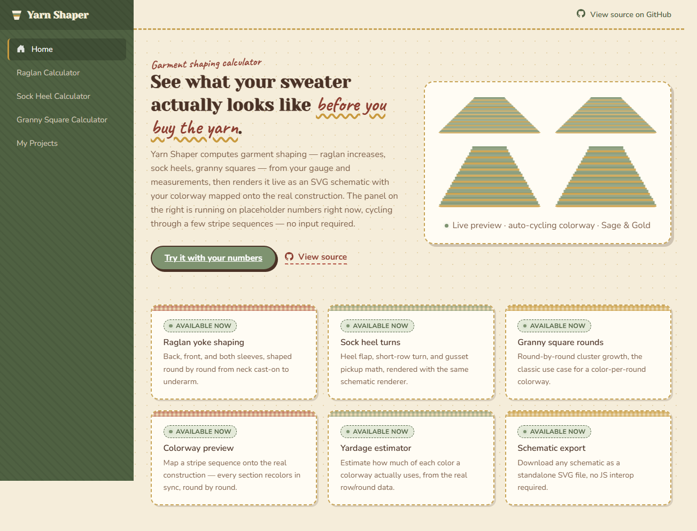

# Yarn Shaper

Yarn Shaper turns your gauge (stitches and rows per inch) and body
measurements into a real, row-by-row shaping pattern — for a sweater
yoke, a sock heel, or a granny square — and draws exactly what you'll
end up making, live, as you type. No guessing what a schematic means:
you see your actual project take shape before you cast on.

It has a cozy, hand-crafted look — stitched borders, gingham accents, a
handwritten script — instead of a typical sleek app interface.

**Live demo:** [mollygilchrist03.github.io/YarnShaper](https://mollygilchrist03.github.io/YarnShaper/)




## What it does

**Raglan sweater yokes.** Enter your gauge and body measurements and get
a full shaping schedule — back, front, and both sleeves — drawn as a
picture that grows exactly the way your yoke will. An ease field lets
you dial in a closer or looser fit, and a toggle switches between
top-down (shaping from the neck) and bottom-up (shaping from the
underarm) construction.

**Sock heels, three ways.** Pick a classic flap-and-gusset heel, a
short-row heel, or an afterthought heel from one dropdown, and the
shaping schedule (and its picture) updates to match.

**Granny squares — or hexagons, or triangles.** Set how many corners
your motif has, and the round-by-round stitch counts adjust to fit.

**Preview your colors before you buy the yarn.** Build a stripe
sequence and see it mapped onto the real construction, section by
section, in sync. You can also look up real yarn: search by name or
brand, filter by weight, or click a color and see which real yarn
colorways are closest to it. Once you have a colorway you like, one
click turns your estimated yardage into an actual shopping list —
a suggested real yarn for every color. (This part talks to a small
proxy service and is off by default in your own copy of the project;
see [Tech stack](#tech-stack) below.)

**Know how much yarn to buy.** The raglan and sock heel calculators
estimate how many yards of each color your project will actually use.

**Save it, share it, come back later.** Save any project to your
browser and reopen it from the **My Projects** page, or copy a
shareable link that has the whole setup baked in — no account, and it
works on any device.

**Export what you make.** Download any picture as an SVG file, or save
the whole results page as a PDF.

Every input is checked as you type, with a clear message if something's
off, so you never end up looking at a schematic built from a typo.

## Accuracy

`YarnShaper.Core`'s calculators are simplified, proportional models of
each construction, not a re-implementation of any one published pattern's
exact technique. [`docs/ACCURACY.md`](docs/ACCURACY.md) hand-traces real
patterns against the calculators and documents what matches exactly, what
has a known, regression-pinned gap (the sock heel gusset is 2 stitches
short of patterns that pick up an extra "ladder" stitch to close a hole),
and what construction isn't modeled yet at all — credibility from showing
the actual comparison, not from claiming a perfect match.

## Notable engineering decisions

- **The shaping math is the actual point, so it's isolated and tested on
  its own.** `YarnShaper.Core` has zero UI dependencies — the raglan
  calculator ([`RaglanShapingCalculator.cs`](src/YarnShaper.Core/Algorithms/RaglanShapingCalculator.cs))
  is a pure function from gauge + measurements to a stitch schedule, with
  its reasoning written out as XML doc comments rather than left implicit
  in the code.
- **Distributing shaping without clumping is a real algorithm, not a
  loop.** A raglan's four sections (back, front, two sleeves) each need a
  *different* number of shaping rounds to reach their target
  circumference, but all share the same row budget. Naively front-loading
  N events into the first N rows leaves a section idle for the rest of the
  piece. [`EvenDistribution.cs`](src/YarnShaper.Core/Algorithms/EvenDistribution.cs)
  spreads N events across M rows using the same integer error-accumulation
  technique as Bresenham's line algorithm — exact counts, no floating-point
  drift, no two events more than one row-gap apart.
- **Bottom-up raglan reuses top-down's row-building machinery, mirrored,
  not duplicated.** The only real differences between the two directions
  are which end each section starts/targets and whether a shaping round
  adds or removes 2 stitches. `RaglanShapingCalculator` expresses both as
  one shared `BuildSection` method parameterized by a signed delta, so the
  two styles can't silently drift out of sync with each other — and the
  schematic still draws the same visual garment silhouette either way,
  via a `RowOneAtTop` flip rather than a second rendering path.
- **Tests check invariants, not a memorized pattern.** Rather than
  hand-copying a "known good" schedule from a real pattern (and risking a
  silently-wrong fixture), most of the unit-test suite asserts what has to
  be true of any correct schedule: monotonic stitch growth, exactly ±2
  stitches per shaping round, convergence on the target circumference
  within rounding tolerance, and a hard failure when the yoke is too
  shallow for the required shaping.
- **A short-row heel's schematic tracks the *active* stitch count, not a
  fabricated increase/decrease.** Unlike a flap-and-gusset heel, a
  short-row heel never actually changes the round's total stitch count —
  it narrows the working range to a center point with wraps, then widens
  back out. Modeling that narrowing/widening as the section's stitch count
  (rather than forcing it through the same increase/decrease bookkeeping
  as the other styles) means the rendered schematic draws the heel's
  actual hourglass shape, for free.
- **The sock heel's stitch counts are rounded so the gusset math always
  divides evenly, not just for round numbers.** A heel turn always ends at
  H/2 + 2 stitches and a gusset always picks up 3H/2 + 2, so decreasing 2
  stitches per round only lands back on the original heel-needle count if
  that total is a multiple of 4. Rather than validating that constraint
  and rejecting awkward inputs,
  [`SockHeelShapingCalculator`](src/YarnShaper.Core/Algorithms/SockHeelShapingCalculator.cs)
  rounds the total round to the nearest multiple of 8 up front, so the
  convergence is exact for any gauge/circumference combination — the
  derivation is in the class's XML doc remarks alongside the code.
- **SVG straight from Razor, no Canvas/JS interop.** `SchematicRenderer.razor`
  takes a section's row list and draws it directly as stacked, proportionally
  widening `<rect>` bands — the "hard-to-fake" part of a schematic (shaping
  visibly reshaping the section) falls out of the data instead of being
  drawn by hand.
- **Exporting a schematic doesn't need JS interop either.** The same row
  layout that renders the on-screen `<svg>` is built once as a string,
  base64-encoded into a `data:` URI, and set directly as an `<a download>`
  element's `href` — the browser handles the actual file save. That also
  guarantees the download can never drift from what's on screen, since
  they're computed from the exact same data.
- **PDF export reuses the browser's own print pipeline instead of adding a
  PDF library.** A `@media print` stylesheet hides the nav, form, and
  action buttons and keeps the schematics, stats, and yardage table
  intact with colors preserved; a "Download as PDF" button just calls
  `window.print()`. One line of JS interop instead of a new dependency.
- **Save and share reuse the exact same payload shape, just two different
  places to put the bytes.** Both features serialize a calculator's
  gauge/measurements/colorway to the same JSON shape — local save writes
  it to `localStorage` under a generated ID, a shareable link base64-encodes
  it straight into the URL's query string. Loading either path calls the
  same `ApplyPayload` method, so there's exactly one place that knows how
  to restore a calculator's state from saved data.
- **Trim-safe JSON, because "works in `dotnet run`" isn't the same claim
  as "works in the published app."** Blazor WebAssembly publishes with IL
  trimming on, which can silently strip the reflection metadata
  `System.Text.Json` needs for plain POCOs — a bug that's invisible in the
  dev server and only appears in the trimmed Release build actually
  deployed to GitHub Pages. Save/share payloads are serialized through a
  source-generated `JsonSerializerContext` instead, and verified against
  an actual `dotnet publish -c Release` output, not just the dev server.
- **The colorway layer is keyed by absolute row number, not per-section
  index.** It would be simpler to map each section's own row list
  independently, but that's physically wrong for a raglan — back, front,
  and both sleeves are worked in the same round simultaneously.
  [`ColorwayMapper`](src/YarnShaper.Core/Colorways/ColorwayMapper.cs) maps
  the stripe pattern once against the shared row count and hands the same
  `RowNumber → color` map to every section, so a stripe boundary lines up
  identically across all four schematics.
- **Not every construction needs the hard algorithm.** The granny motif's
  N-clusters-per-round rule is a closed-form formula (`cornerCount * round`),
  so [`GrannySquareRoundsCalculator`](src/YarnShaper.Core/Algorithms/GrannySquareRoundsCalculator.cs)
  doesn't reach for `EvenDistribution` at all — deliberately, since forcing
  every calculator through the same machinery would hide which problems
  actually need it.
- **Yardage is derived from the same gauge already on screen, not a
  separate yarn-weight picker.** There's no way to get exact yardage from
  stitch counts alone — only weighing a real swatch does that — but
  [`YardageEstimator`](src/YarnShaper.Core/Yardage/YardageEstimator.cs)
  uses a widely-cited rule of thumb (a stitch uses about 5&times; its own
  width in yarn) and reuses the calculator's existing stitches-per-inch
  for that width, so there's one fewer input to keep in sync with reality.
  It's deliberately **not** wired into the granny square page: that
  calculator's stitch count is a crochet cluster count, not a real stitch
  count, and faking a cluster-to-stitch conversion would produce a number
  that looks precise without being grounded in anything.
- **Validation gates calculation instead of racing it.** Every gauge and
  measurement field is `[Range]`-validated with an inline message, and the
  calculator checks the form's validity before touching the domain layer
  at all — an invalid field clears the results rather than letting the
  shaping algorithm run on whatever partial number is currently typed.
- **CI gates the deploy on the test suite.** The GitHub Actions workflow
  runs `dotnet test` before it ever builds or publishes — a broken shaping
  calculation can't reach the live site.
- **GitHub Pages serves static files only, which breaks client-side
  routing.** A direct hit on `/raglan` 404s because there's no physical
  file at that path. The standard fix — copying `index.html` to `404.html`
  so Pages serves the app shell for any unmatched route while the browser
  keeps the real URL — is wired into the deploy workflow.
- **A static WASM bundle can't hold a secret, so the one feature that
  needs one lives outside it.** Real yarn-colorway matching calls a
  third-party API gated behind a RapidAPI key; embedding that key in the
  published app would expose it to anyone who opens dev tools. Instead
  [`workers/yarn-colorway-proxy`](workers/yarn-colorway-proxy) is a tiny,
  stateless Cloudflare Worker that holds the key and caches responses for
  24h to stay inside the free API tier — the only server-side code in the
  project, and it knows nothing beyond "relay this one endpoint."
- **Free-text yarn search needed a workaround the upstream API doesn't
  offer.** The Yarn Colorways API's `brand`/`yarn` filters only match an
  exact name — typing "casc" finds nothing, only "Cascade" does — which
  makes search-as-you-type impossible against them directly. The proxy
  fetches and caches the full brand/yarn name lists (small, slow-changing
  payloads) and does its own substring matching locally, then queries
  colorways for whatever it found — so "casc" in the UI still surfaces
  real Cascade yarn.

## Tech stack

| Layer | Choice |
|---|---|
| Framework | Blazor WebAssembly (.NET 9) |
| Shaping math | Plain C# class library (`YarnShaper.Core`), no UI dependencies |
| Rendering | Inline SVG generated from Razor components — no Canvas |
| Persistence | Browser `localStorage` (save) and URL query string (share) — no backend, no database |
| Yarn colorway lookup (opt-in) | [Cloudflare Worker proxy](workers/yarn-colorway-proxy) — the only server-side code in the project, holds no state of its own beyond a response cache |
| Browser interop | Minimal, targeted JS interop for localStorage, clipboard, and `window.print()` only |
| Testing | xUnit (`YarnShaper.Core.Tests`) — unit tests plus a fixture-based accuracy suite against real patterns |
| CI/CD | GitHub Actions — test → publish → deploy |
| Hosting | GitHub Pages (static, free) |

## Local setup

```bash
dotnet build
dotnet test
dotnet run --project src/YarnShaper.Web
```

## What's next

Every calculator from the original build plan, plus construction coverage
(raglan ease and top-down/bottom-up, three sock heel styles, any granny
motif corner count), save/share/export, input validation, an
accuracy-tested foundation, and a responsive layout audited down to
320px-wide phones are shipped. What's left:

- **More accuracy fixtures.** `docs/ACCURACY.md` documents one real
  comparison per calculator's construction; more real patterns, especially
  ones matching the newer heel/raglan styles, would sharpen it further.
